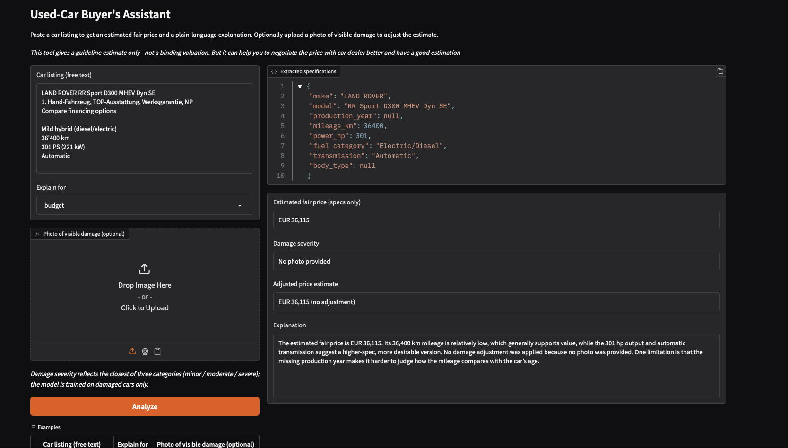
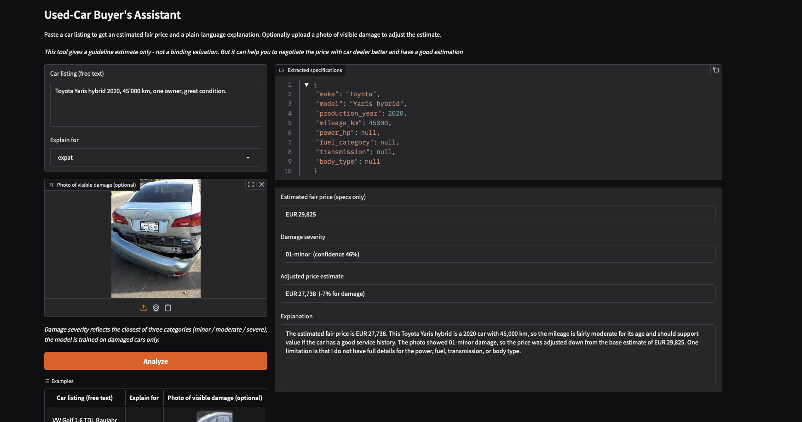

# AI Applications Project Documentation Template

Use this template to document your project concisely and completely.
Fill in all required fields. Keep answers short and precise.

## Documentation Hint

Important:
When possible, reference the corresponding code location directly in your description.

### Example: Reference to a notebook section

Reference to the header `## Data Preprocessing` in the notebook `analysis.ipynb`:

> See *Data Preprocessing* in
> [`analysis.ipynb`](analysis.ipynb#data-preprocessing)

### Example: Reference to Python code

Reference to a single line in `model.py`, line 42:
> [`model.py`, line 42](model.py#L42)

Reference to multiple lines in `train.py`, lines 15-38:
> [`train.py`, lines 15-38](train.py#L15-L38)

## Project Metadata

- Project title: Used-Car Buyer's Assistant
- Student: Seyid Hussein Husseini
- GitHub repository URL: <https://github.com/husse786/zhaw-car-buyers-assistant>
- Deployment URL: <https://huggingface.co/spaces/hussesey/zhaw-aiapp-used-car-assistant>
- Submission date: 05.06.2026

### Mandatory Setup Checks

- [x] At least 2 blocks selected
- [x] Multiple and different data sources used
- [x] Deployment URL provided
- [x] Required GitHub users added to repository (`jasminh`, `bkuehnis`)

## Selected AI Blocks

- [x] ML Numeric Data
- [x] NLP
- [x] Computer Vision

Primary blocks used for core solution (choose 2):

- Primary block 1: ML Numeric Data, predicts a fair used-car price from specifications.
- Primary block 2: NLP, extracts specs from a free-text listing and explains the price in plain, persona-adapted language (RAG grounded).

If a third block is selected, it is documented and graded separately as extra work.

- Third block :Computer Vision, classifies visible damage severity, which adjusts the price estimate.

Guidance hint: Keep the project idea short and consistent. Focus most details on the selected blocks.
Evidence hint: Show where each selected block contributes to the final system.

---

## 1. Project Foundation (Short)

### 1.1 Problem Definition

- Problem statement: Non-expert buyers struggle to judge whether a used-car listing is fairly priced. They cannot easily assess a car's condition from photos and do not know what specifications such as mileage, fuel type, or transmission mean for value. This information asymmetry disadvantages them against sellers and car dealers.
- Goal: Estimate a guideline fair price from a free-text listing, adjust it for visible damage when a photo is supplied, and explain the result in plain, persona-adapted language.
- Success criteria:
  - Price model beats baseline (R² 0.946, MAE €4,651, MAPE 11.5%)
  - Damage classifier distinguishes severity (accuracy 0.685, macro-F1 0.682)
  - Clear, knowledge-grounded, persona-adapted explanations
  - Working public deployment

### 1.2 Integration Logic

- How the selected blocks interact: The blocks form one pipeline. NLP extracts structured specs from the listing; these feed the ML model, which predicts a base price. CV classifies damage severity from an optional photo, driving a rule-based price adjustment (decision logic). NLP then produces a final RAG-grounded explanation combining specs, price, and damage. The full pipeline is orchestrated in [`app/app.py`](app/app.py) (function `analyze`).
- Data and output flow between blocks:

```markdown
listing text ──> NLP extract ──> specs ──┐
                                         ├──> ML model ──> base price ──┐
photo (optional) ──> CV severity ────────┘                             │
                          └──> decision-logic adjustment ──> adjusted price
   specs + base price + severity + adjusted price + persona ──> NLP (RAG) ──> explanation
```

Guidance hint: This section should be short. The detailed work belongs in block sections.
Evidence hint: Include one clear pipeline overview.

---

## 2. Block Documentation

Complete only selected blocks. Mark non-selected block sections as N/A.

### 2A. ML Numeric Data (If selected)

#### 2A.1 Data Source(s)

List every usage of a data source as a separate entry. If the same source is used twice for different roles, add it twice.

| Entry | Source name or link | Type | Size | Role in this block |
| --- | --- | --- | --- | --- |
| 1 | AutoScout24 used-car listings (Kaggle, 2025 snapshot) <https://www.kaggle.com/datasets/clkmuhammed/autoscout24-car-listings-dataset> | Tabular (CSV) | ~118k rows × 75 cols (raw); 109,396 after cleaning | Training data for the price regression model |

#### 2A.2 Preprocessing and Features

- Cleaning steps:
Restricted to a single currency (EUR) and a plausible price range (€500–€150,000); removed rows with impossible or missing production years, non-positive engine power, and clipped extreme mileage; dropped leakage columns (e.g. net price, VAT rate) and non-predictive free-text/administrative columns; removed duplicate rows. The row count was tracked after each step (118,382 → 109,396 rows). See *Data Cleaning* in [`01_eda_preprocessing.ipynb`](notebooks/01_eda_preprocessing.ipynb#5-data-cleaning).

- Preprocessing steps: Applied a `log1p` transform to the target price (heavy right skew); standardised numeric features with `StandardScaler`; encoded low-cardinality categoricals with `OneHotEncoder(handle_unknown='ignore')`; applied frequency encoding to high-cardinality columns (`make`, `model`, `original_market`). All encoders and statistics were fit on the training split only to prevent data leakage. See *Preprocessing Pipeline* in [`02_ml_price_model.ipynb`](notebooks/02_ml_price_model.ipynb#2-preprocessing-pipeline-fit-on-train-only).

- Feature engineering and selection: Derived `car_age` (current year − production year) and `mileage_per_year` (mileage normalised by age). Excluded high-cardinality free-text fields and leakage-prone columns. The strongest predictors of price were `power_hp`, `car_age`, and `mileage_km`. See *Feature Engineering* in [`01_eda_preprocessing.ipynb`](notebooks/01_eda_preprocessing.ipynb#6-feature-engineering).

#### 2A.3 Model Selection

- Models tested: Ridge Regression (regularised linear baseline), Random Forest Regressor, and HistGradientBoostingRegressor.
- Why these models were chosen: The Ridge baseline establishes a reference point with a simple linear model and shows how much non-linear methods improve on it. Random Forest and HistGradientBoosting are tree-based ensembles chosen because used-car price depends on non-linear interactions between features (e.g. the effect of mileage differs by car age and engine power), which a linear model cannot capture. Gradient boosting was included as it typically reaches lower bias than bagging by fitting residuals sequentially. Hyperparameters were tuned on the validation split, and the final model was selected by validation performance. See *Model Training & Comparison* in [`02_ml_price_model.ipynb`](notebooks/02_ml_price_model.ipynb#3-model-training--comparison--3-models).

#### 2A.4 Model Comparison and Iterations

| Iteration | Objective | Key changes | Models used | Main metric | Change vs previous |
| --- | --- | --- | --- | --- | --- |
| 1 | Establish a baseline | Linear model on encoded features; `log1p` target | Ridge | Test R² −0.44; RMSE €38,858; MAE €10,333 | — (reference) |
| 2 | Capture non-linear feature interactions | Switched to a bagging tree ensemble | Random Forest | Test R² 0.932; RMSE €8,418; MAE €4,863 | Large gain over baseline (R² −0.44 -> 0.932) |
| 3 | Reduce bias further | Switched to gradient boosting (sequential residual fitting) | HistGradientBoosting | Test R² 0.946; RMSE €7,604; MAE €4,651 | Best result; selected model (RMSE €8,418 -> €7,604) |

#### 2A.5 Evaluation and Error Analysis

- Metrics used: RMSE, MAE, MAPE, and R², all computed in Euros (the `log1p` target transform is inverted with `expm1` before scoring). Data was split 80/10/10 into train/validation/test (seed 42). Models were compared on the validation split and the selected model was evaluated once on the held-out test set.
- Final results (HistGradientBoosting, test set): RMSE €7,604, MAE €4,651, MAPE 11.5%, R² 0.946.
- Error patterns and likely causes:
  - Highest percentage error on cheap cars (<€5k): approx. 41% MAPE, because small absolute errors are large relative to a low price, and budget listings have noisier pricing.
  - Largest absolute errors on high-end cars (>€60k): fewer training examples at the top of the range and luxury premiums that are hard to learn from specifications alone.
  - Error rises with car age: from approx.8.9% MAPE for 0–3 year-old cars to approx. 32% for cars over 20 years, where rarity and condition (not captured in the data) drive price.
  - Electric/hybrid and rare fuel types (e.g. LPG) are less accurate, reflecting volatile and feature-dependent pricing not fully represented in the specifications.
  
  See Error Analysis in [`02_ml_price_model.ipynb`](notebooks/02_ml_price_model.ipynb#5-error-analysis).

#### 2A.6 Integration with Other Block(s)

- Inputs received from other block(s): Structured car specifications (make, model, production year, mileage, power, fuel category, transmission, body type) extracted by the NLP block from the user's free-text listing. Specifications not present in the listing are filled with the model's training-time defaults before prediction.
- Outputs provided to other block(s): A base fair-price estimate in EUR. This estimate is then (a) adjusted by a rule-based factor driven by the Computer Vision damage-severity output (decision logic), and (b) passed to the NLP block, which explains the price and the specifications in plain language. The full pipeline is orchestrated in the `analyze` function in [`app.py`, Main orchestration](app/app.py).

Guidance hint: Keep entries practical and evidence-based.
Evidence hint: Add values, not only claims.

### 2B. NLP

#### 2B.1 Data Source(s)

List every usage of a data source as a separate entry. If the same source is used twice for different roles, add it twice.

| Entry | Source name or link | Type | Size | Role in this block |
| --- | --- | --- | --- | --- |
| 1 | `carknowledge.md` — curated used-car buying knowledge base, compiled from public car-buying websites (e.g. Carwow and similar guides) | Text (Markdown) | ~23,750 characters; 11 concept sections | Knowledge base for retrieval-augmented generation (RAG): grounds the explanation in verified car-buying facts |
| 2 | User free-text car listing (runtime input) | Text (user input) | One short text per request | Source text from which the LLM extracts structured specifications |

#### 2B.2 Preprocessing and Prompt Design

- Text preprocessing: The knowledge base is split into concept-level chunks by section heading, so each chunk is one self-contained topic (e.g. mileage, vehicle history report, frame damage), producing 11 chunks. Each chunk is embedded once with the OpenAI `text-embedding-3-small` model (1536-dimensional vectors) and stored in memory at startup. At query time, a query is embedded and the most relevant chunks are retrieved by cosine similarity (top-k = 3). See *Stage C — RAG* in [`04_nlp_rag.ipynb`](notebooks/04_nlp_rag.ipynb#stage-c--grounded-explanation-with-retrieval-augmented-generation-ra).

- Prompt design or retrieval setup: Two LLM prompts are used.
  - Extraction prompt (`temperature = 0` for consistency): a system instruction asks for strict JSON with a fixed set of keys, requires numeric values for numeric fields, constrains categorical fields (fuel, transmission, body type) to the exact vocabulary the price model was trained on, and returns `null` for values not stated rather than guessing. One worked example is included to anchor the format.
  - Explanation prompt (`temperature = 0.3`): a system instruction adapts the answer to a chosen buyer persona (first-time / budget-conscious / non-native speaker), explains the specifications and the predicted price in plain language, weaves in the retrieved knowledge-base context for grounding, and requires exactly one uncertainty note. It is instructed not to recompute the price.
  See *Stage A: Extract* and *Stage B: Explain* in [`04_nlp_rag.ipynb`](notebooks/04_nlp_rag.ipynb#stage-a--extract-car-specs-from-free-text-llm).

#### 2B.3 Approach Selection

- Approach used (classical NLP, transformer, RAG, prompt engineering): A combination of prompt engineering and retrieval-augmented generation (RAG). Prompt engineering drives two LLM calls: structured spec extraction (strict JSON, constrained vocabulary) and a persona-adapted explanation. RAG augments the explanation by retrieving relevant chunks from the curated knowledge base and injecting them into the prompt, so advice is grounded in verified car-buying facts rather than the model's internal knowledge alone.
- Alternatives considered: A prompt-only explanation (no retrieval) was implemented first and kept as the comparison baseline; RAG was then layered on top to reduce vague or unsupported claims. A fully local stack (open-source LLM with a vector database such as FAISS) was considered but not chosen: OpenAI embeddings with in-memory cosine similarity were sufficient for a small knowledge base (11 chunks) and kept the deployment lightweight. See *Stage C — RAG* and the prompt-only vs. RAG comparison in [`04_nlp_rag.ipynb`](notebooks/04_nlp_rag.ipynb#stage-c-evaluation--prompt-only-vs-rag-grounded-explanation).

#### 2B.4 Comparison and Iterations

| Iteration | Objective | Key changes | Model or prompt setup | Main metric or qualitative check | Change vs previous |
| --- | --- | --- | --- | --- | --- |
| 1 | Reliable spec extraction | Extraction prompt returning strict JSON | LLM, `temperature = 0`, one worked example | Valid JSON returned; but categorical values echoed the listing's wording (e.g. "petrol", "automatic"), risking mismatch with the price model's vocabulary | — (initial) |
| 2 | Prevent encoding mismatch | Constrained categorical outputs to the price model's exact training vocabulary; `null` for unstated values | Same call with an updated system prompt | Categorical values now standardised (e.g. "petrol" → "Gasoline"); unstated fields correctly returned as `null` | Eliminated silent feature-mismatch at the ML interface |
| 3 | Ground the explanation in verified facts | Added RAG: retrieve top-3 knowledge chunks and inject into the explanation prompt | Explanation prompt + retrieval (cosine similarity) | Qualitative: RAG version referenced verified concepts (pre-purchase inspection, history check, mileage wear) absent from the prompt-only version | More grounded, source-backed advice vs. prompt-only |

See the prompt-only vs. RAG comparison in *Stage C — Evaluation* in [`04_nlp_rag.ipynb`](notebooks/04_nlp_rag.ipynb#stage-c-evaluation--prompt-only-vs-rag-grounded-explanation).

#### 2B.5 Evaluation and Error Analysis

- Evaluation strategy: The NLP block was evaluated qualitatively, because there is no labelled ground truth for "correct" explanations. Extraction was checked by running varied listings (German/Swiss and English, complete and sparse) and verifying the JSON was valid, the values were standardised to the price model's vocabulary, and unstated fields were returned as `null` rather than guessed. The explanation was assessed by comparing the prompt-only and RAG-grounded versions on the same car and by checking persona adaptation across the three buyer profiles.
- Results: Extraction produced valid, correctly standardised JSON across test listings (e.g. Swiss "120'000 km" parsed to 120000; "petrol"/"automatic" mapped to "Gasoline"/"Automatic"; missing power/transmission returned as `null`). The RAG-grounded explanation referenced verified knowledge-base concepts (e.g. pre-purchase inspection, vehicle-history check, mileage-related wear) that the prompt-only version did not. Persona adaptation produced visibly different focus and reading level (e.g. the budget persona emphasised running costs; the non-native persona used shorter, simpler sentences).
- Error patterns and likely causes:
  - Ambiguous categorical values are handled conservatively rather than guessed: e.g. a "hybrid" listing was returned as fuel `Unknown` instead of choosing a specific hybrid subtype, since the type was not explicit.
  - Retrieval precision is moderate: for some queries the top-3 chunks include a loosely related section (e.g. lemon laws), because the knowledge base is small and several concepts overlap. The most relevant chunk is still retrieved, so the grounded answer remains accurate, but retrieval is not always tightly focused.
  - Persona differentiation is real but moderate: explanations share a similar opening and uncertainty-note structure across personas, with the main variation in focus and sentence complexity.
  
  See *Stage A — Extract*, *Stage B — Explain*, and *Stage C — Evaluation* in [`04_nlp_rag.ipynb`](notebooks/04_nlp_rag.ipynb#stage-c-evaluation).

#### 2B.6 Integration with Other Block(s)

- Inputs received from other block(s): The base price estimate (EUR) from the ML block, and the damage severity label (minor / moderate / severe) from the Computer Vision block when a photo is provided. The block also receives the user's free-text listing and chosen persona directly.
- Outputs provided to other block(s): Structured specifications (as JSON) that feed the ML price model, and the final natural-language explanation shown to the user — combining the specs, the predicted price, the damage adjustment, and retrieved knowledge.
- Representative output (Audi A4 Avant, 2019, 78,000 km, petrol, automatic; minor damage photo; first-time-buyer persona):
  - Extracted specs → `{"make": "Audi", "model": "A4 Avant", "production_year": 2019, "mileage_km": 78000, "power_hp": 190, "fuel_category": "Gasoline", "transmission": "Automatic", "body_type": "Station wagon"}`
  - Base price €25,282 → minor-damage adjustment −7% → adjusted €23,513
  - Explanation (excerpt): states the adjusted price, explains that 78,000 km mileage indicates moderate wear that reduces value, notes the minor-damage adjustment, and closes with an uncertainty note about service history and hidden issues.

  The full pipeline is orchestrated in the `analyze` function in [`app.py`, Main orchestration](app/app.py).

### 2C. Computer Vision

#### 2C.1 Data Source(s)

List every usage of a data source as a separate entry. If the same source is used twice for different roles, add it twice.

| Entry | Source name or link | Type | Size | Role in this block |
| --- | --- | --- | --- | --- |
| 1 | [Car Damage Severity Dataset (Kaggle, prajwalbhamere)](https://www.kaggle.com/datasets/prajwalbhamere/car-damage-severity-dataset) | Image (JPEG) | ~1,631 images in 3 classes (1,383 train / 124 validation / 124 test) | Training, validation, and test data for the damage-severity classifier |

#### 2C.2 Preprocessing and Augmentation

- Image preprocessing: Images are converted to RGB, resized to 224×224, and normalised using the mean and standard deviation of the pretrained ViT image processor (`google/vit-base-patch16-224`). Validation and test images use a deterministic resize and centre-crop with the same normalisation (no augmentation), so evaluation reflects clean inputs. See *Image processor + augmentation* in [`03_cv_damage_model.ipynb`](notebooks/03_cv_damage_model.ipynb).
- Augmentation strategy: Applied to the training set only, and kept "damage-safe" so that the visual damage cues are preserved. The transforms are a mild random resized crop (scale 0.85–1.0), a horizontal flip (a dent is still a dent when mirrored), and mild colour jitter (brightness/contrast ±0.2). Aggressive rotations and strong colour distortions were deliberately avoided, as they could hide or fabricate damage signals.
See *Image processor + augmentation* in [`03_cv_damage_model.ipynb`](notebooks/03_cv_damage_model.ipynb).

#### 2C.3 Model Selection

- Vision model(s) used: A Vision Transformer (ViT), `google/vit-base-patch16-224`, fine-tuned with transfer learning. The pretrained backbone was frozen and only a new 3-class classifier head was trained (2,307 trainable parameters out of ~85.8M).
- Why these model(s) were chosen: Transfer learning with a pretrained ViT is well suited to a small dataset (~1,631 images): the backbone already encodes general visual features, so only a small classifier head needs to learn the damage-severity task. Freezing the backbone keeps training fast and reduces the risk of overfitting on limited data. ViT was chosen for its strong image-classification performance and straightforward fine-tuning workflow. See *Load the ViT and freeze the backbone* in [`03_cv_damage_model.ipynb`](notebooks/03_cv_damage_model.ipynb).

#### 2C.4 Model Comparison and Iterations

| Iteration | Objective | Key changes | Model(s) used | Main metric | Change vs previous |
| --- | --- | --- | --- | --- | --- |
| 1 | Fine-tune a damage-severity classifier on a small dataset | Transfer learning: frozen ViT backbone, new 3-class head; damage-safe augmentation; 8 epochs; best epoch selected by macro-F1 | ViT (`google/vit-base-patch16-224`) | Validation accuracy 0.734, macro-F1 0.720 (best epoch); test accuracy 0.685, macro-F1 0.682 | — (single configuration) |

Note: A single model configuration was used for this block. Validation accuracy/F1 improved over the first epochs (≈0.67 → ≈0.73) and then plateaued, indicating convergence; the best epoch by macro-F1 was retained. A zero-shot baseline (e.g. CLIP) was considered as a comparison but not implemented, to keep block focused.
See the training and evaluation cells in [`03_cv_damage_model.ipynb`](notebooks/03_cv_damage_model.ipynb).

#### 2C.5 Evaluation and Error Analysis

- Metrics and/or visual checks: Accuracy and macro-averaged precision, recall, and F1 (macro so each class counts equally), plus a confusion matrix and a per-class report on the held-out test set (124 images, evaluated once). Macro-averaging was chosen so the model cannot look good by only handling the easiest class well.
- Final results: Accuracy 0.685, macro-F1 0.682. Per-class F1: minor 0.744, moderate 0.525, severe 0.778. Severe damage was detected most reliably (recall 0.81) and minor reasonably well (0.74); the middle "moderate" class was the weakest (F1 0.525).
- Error patterns and limitations:
  - The "moderate" class is the hardest, confused in both directions (toward minor and toward severe) — expected, since "moderate" is the fuzzy middle of a subjective severity scale where even human labels disagree.
  - Errors are almost entirely between adjacent severity levels: in the confusion matrix only 1 image was misclassified minor→severe and 0 severe→minor. The model rarely makes a two-step ("catastrophic") error, indicating it has learned the underlying ordering of severity and mainly blurs the boundaries between neighbouring classes.
  - Limitation - class scope: the dataset contains only damaged cars (no "undamaged/good" class), so the model always assigns one of the three damage levels. A clean car is forced into the closest category (typically "minor"). This is surfaced honestly in the app, and predictions are shown with a confidence value so low-confidence outputs are visibly uncertain.

  See the evaluation and confusion-matrix cells in [`03_cv_damage_model.ipynb`](notebooks/03_cv_damage_model.ipynb).

#### 2C.6 Integration with Other Block(s)

- Inputs received from other block(s): None directly. The Computer Vision block takes the user's uploaded photo (an optional runtime input). It operates independently of the other blocks' outputs.
- Outputs provided to other block(s): A damage-severity label (minor / moderate / severe) plus a confidence value. This output drives a rule-based price adjustment (decision logic) applied to the ML block's base price — minor −7%, moderate −20%, severe −40% — and is also passed to the NLP block, which mentions the damage and its effect in the explanation. If no photo is provided, no adjustment is applied.
- Concrete example (real prediction): for a base price of €25,282 with an uploaded damage photo classified as "minor" (confidence 46%), the adjustment of −7% produced an adjusted estimate of €23,513, and the explanation noted the minor-damage adjustment.
- Observed failure case: the same photo was a genuinely severe-damage example that the model classified as "minor" with low confidence (46%) — consistent with the model's ~68% accuracy and the inherent difficulty of severity boundaries. Because the predicted confidence is shown to the user, such low-confidence outputs are visibly uncertain, and the modest minor-damage adjustment limits the impact of an occasional misclassification on the final estimate.

The adjustment logic is implemented in the `apply_damage_adjustment` function and orchestrated in `analyze` in [`app.py`](app/app.py).

---

## 3. Deployment

- Deployment URL: <https://huggingface.co/spaces/hussesey/zhaw-aiapp-used-car-assistant>
- Main user flow: The user pastes a free-text car listing, selects a buyer persona (first-time / budget / non-native speaker), and optionally uploads a photo of visible damage. On clicking **Analyze**, the app extracts the specifications (NLP), predicts a base fair price (ML), classifies damage severity from the photo and applies a rule-based price adjustment (CV + decision logic), and returns a plain-language, RAG-grounded explanation. The interface displays the extracted specifications, the base price, the damage severity, the adjusted price, and the explanation.
- Screenshot or short demo:





---

## 4. Execution Instructions

- Environment setup: Clone the repository and install dependencies. The deployed app uses the dependencies in `app/requirements.txt`

```bash
git clone <https://github.com/husse786/zhaw-car-buyers-assistant>
cd zhaw-car-buyers-assistant
python -m venv .venv && source .venv/bin/activate
pip install -r app/requirements.txt
```

Set the OpenAI credentials as environment variables (locally via a `.env` file in the project root; on Hugging Face via Space Secrets):

```text
LLM_API_KEY= <your-openai-api-key>
LLM_MODEL=gpt-5.4-mini
```

- Data setup: Download the data sources (not committed to the repository): the AutoScout24 listings CSV (Kaggle) for the price model, the Car Damage Severity image dataset (Kaggle) for the vision model, and the `carknowledge.md` text file (included in `data/`). The trained price model (`models/price_model.pkl`) is produced by the ML notebook; the vision model is hosted on Hugging Face (`hussesey/zhaw-aiapp-vit-car-damage-severity`) and loaded at runtime.
- Training command(s): Training is done offline in the notebooks (not in the app):
  - `notebooks/01_eda_preprocessing.ipynb` — clean the AutoScout24 data and produce `data/autoscout_clean.csv`.
  - `notebooks/02_ml_price_model.ipynb` — train and compare the price models; saves `models/price_model.pkl`.
  - `notebooks/03_cv_damage_model.ipynb` — fine-tune the ViT damage classifier (run on a GPU, e.g. Lightning AI); the trained model is uploaded to Hugging Face.
  - `notebooks/04_nlp_rag.ipynb` — develop and test the extraction, explanation, and RAG logic.
- Inference/run command(s): Run the app locally from the `app/` folder:

```bash
cd app
python app.py

```

This launches the Gradio interface locally. The deployed version runs the same `app.py` on Hugging Face Spaces.

- Reproducibility notes: All splits use a fixed seed (`random_state=42`). Encoders and statistics are fit on the training split only. The app loads only pre-trained artifacts (the saved price model and the hosted vision model). No training happens at inference time, keeping training and inference cleanly separated.

---

## 5. Optional Bonus Evidence

Use this section for exceptional work beyond the core requirements.

- [x] Third selected block implemented with strong quality
- [x] More than two data sources used with clear added value
- [ ] A core section is done exceptionally well
- [x] Extended evaluation
- [x] Ethics, bias, or fairness analysis
- [x] Creative or exceptional use case

Evidence for selected bonus items:

- Third block (Computer Vision): A full third block beyond the two required. A ViT damage-severity classifier was fine-tuned via transfer learning, evaluated on a held-out test set (accuracy 0.685, macro-F1 0.682), and integrated into the system through a rule-based price adjustment. Documented in §2C.

- More than two data sources with clear added value: Three genuinely different data types power the three blocks - tabular listings (price model), images (damage classifier), and a text knowledge base (RAG explanation). Each source serves a distinct, necessary role.

- Extended evaluation: Beyond headline metrics, the project includes per-segment error analysis for the price model (error by price band, car age, and fuel type), a confusion-matrix-based analysis for the vision model showing that errors are confined to adjacent severity levels, and a qualitative prompt-only vs. RAG-grounded comparison for the NLP block.

- Ethics, bias, and fairness: The application presents estimates as guideline values, not binding valuations, and displays model confidence so uncertain predictions are visible. Honest limitations are surfaced throughout: the vision model is trained only on damaged cars (no "undamaged" class), the price model is trained on European listings (so other markets may differ), and the damage-to-price adjustment is illustrative business logic rather than a market-calibrated figure. The persona feature aims to make explanations accessible across different buyer backgrounds (first-time, budget-conscious, non-native speakers), reducing the information asymmetry the project addresses.

- Creative or exceptional use case: The project targets a real, relatable problem — helping non-expert buyers judge whether a used-car listing is fairly priced and understand what the specifications mean — by chaining three AI blocks (image → severity, text → specs → price, knowledge → explanation) into one decision-support tool.
